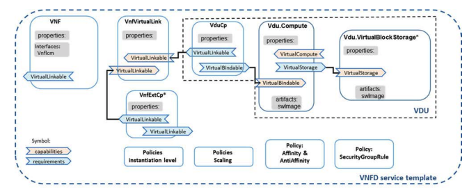

# SOLCon: TOSCA (SOL001) to SOL006 VNFD Converter
Can be run as a package in NSO: 
```
    NSO command to be put here
```
Also can be run standalone:
```
    python3 tosca.py -f examples/standalone_vpc_vnfd_esc_4_4.yaml --dry-run -y etsi-nfv-vnf.yang
```
### TOSCA VNFD Relationships



### USAGE
**Standalone**  
`solcon.py` is the entry point for the standalone version of the converter.  
`config.toml` has all the default and configurable paths and values.


**Arguments**
- -f --file (REQ): The TOSCA VNF YAML file to be processed
- -o --output: The name of the file to be output in JSON format, outputs to stdout if not specified
- -c --path-config (REQ): Location of the paths configuration file (TOML format)
- -l --log-level: Set the log level for NSO and standalone logging
- -n --dry-run: Don't send the converted information to NSO
- -y --yang-template: The given YANG specifications file for the tool to fill out (optional)
- -g --no-grouping: If there are no grouping tags in the YANG specifications file give this tag,
                  otherwise it will fail to parse the file
- -p --prune: Do not prune empty values from the dict at the end


### Current Limitations
* Scaling aspects are not converted at this time
* Only one VNFD in a single file is supported
* Only the default instantiation level is supported
